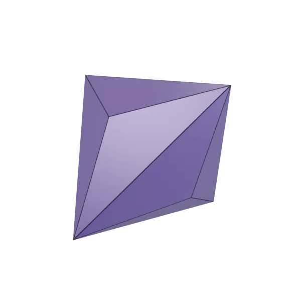

# The 11/20 stellated tetrahedron is not Rupert

<p align="center">
  
</p>

This project proves, in Lean 4, that the stellated tetrahedron `P_{11/20}`
(the convex hull of a regular tetrahedron and its reflection scaled by `11/20`)
does not have [Rupert's property](https://en.wikipedia.org/wiki/Prince_Rupert%27s_cube):
no copy of it fits through a hole in itself.

The statement is `¬ IsRupert exactVerts`, where `IsRupert` is the Mathlib-only definition in
[`Noperts/MainTheorem.lean`](Noperts/MainTheorem.lean) and `exactVerts` are the vertices
defined in [`Noperts/Stellated/Vertices.lean`](Noperts/Stellated/Vertices.lean).

This project grew out of the
[Noperthedron formalization](https://github.com/jcreedcmu/Noperthedron), and shares some of
its infrastructure.

## Structure of the proof

The definitions and the reduction to finitely many certificate checks live in
[`Noperts/Stellated/`](Noperts/Stellated). The bridge to the public statement is in
[`IsNotRupert.lean`](Noperts/Stellated/IsNotRupert.lean): `not_rupert_of_valid_table` (from a
valid certificate table) and `not_rupert_of_root` (from exclusion of the whole root box).

The pose space is covered by three kinds of certificate tables:

* a chart table (`chart0.pack`): projective edge-cycle and balanced-triple certificates over
  a Cayley atlas of rotations;
* local tables (`local-NN.pack`): neighbourhoods of the symmetric poses;
* corner tables (`corner-*.pack`): blow-up coordinates around the corner views where the
  shadows touch at vertices.

The certificate packs (about 1.2 GB, 121 MB compressed) are published as the release
[`data-v1`](https://github.com/dwrensha/StellatedTetrahedron/releases/tag/data-v1) rather than
checked in; `scripts/fetch_packs.sh` downloads them into `packs/` (using the GitHub CLI) and
verifies their checksums.

## Two ways to check the certificates

### Native proof

[`constructStellated`](constructStellated.lean) reads the certificate packs, checks them with
compiled code (trusting the Lean compiler, as `native_decide` does) and constructs the proof:

```
scripts/fetch_packs.sh
lake build constructStellated
.lake/build/bin/constructStellated packs
```

On a 16-core machine this takes about 35 minutes (about 8 CPU-hours).

### Kernel-only proof

The same certificates can be checked by the Lean kernel alone, with no trust in compiled code:
the resulting theorem `stellated_not_rupert_kernel : ¬ IsRupert exactVerts` depends only on
the standard axioms `propext`, `Classical.choice` and `Quot.sound`.

This uses integer and packed-`Nat` checkers that the kernel evaluates quickly
(`LocalKernel*`, `CornerKernel*`, `ChartKernel*`, `CornerAffTree`), each proved sound in
`Noperts/Stellated`, and generators that split the certificate data into kernel-checked
modules under `StellatedKernel/`:

| generator | output |
|---|---|
| [`chartKernelGen`](chartKernelGen.lean) | the chart table: 659 modules of `decide +kernel` chunks, and their assembly |
| [`localKernelGen`](localKernelGen.lean) | the 60 local tables, each split into slices checked in parallel |
| [`kernelCorner`](kernelCorner.lean) `ktreegen` | the 70 integer corner tables |
| [`cornerAffGen`](cornerAffGen.lean) | the corner tables that need an affine reparametrization |

Each generated module stays within a few GB of memory, so `lake build` can check them all at
full parallelism. On a 16-core, 94 GB machine the whole kernel proof takes about 105 CPU-hours,
roughly 7 hours of wall-clock time.

The generated modules and their data (about 230 MB) are not yet part of this repository;
until they are, `lake build` builds only the `Noperts` library.

## Other contents

* [`scripts/`](scripts): the Python certificate search that produced the tables (not needed
  to check the proof), with a native helper in [`rust/corner-kernel`](rust/corner-kernel).
* `checkStellatedRows`, `checkCornerPack`, `checkLocalPack`, `stellatedDryRun`, `compact*`,
  `shareCorner`, `bench*Row`: tools for validating, compacting and profiling the tables.

## Getting started

[Install Lean](https://lean-lang.org/install/manual/), clone this project, then:

```
lake exe cache get
lake build
```
